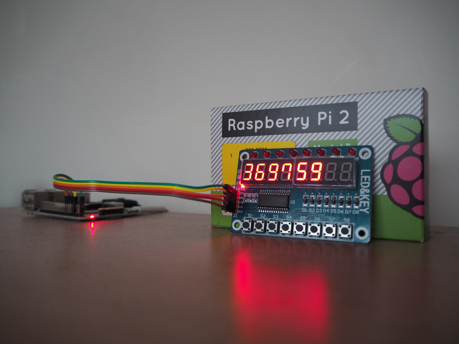
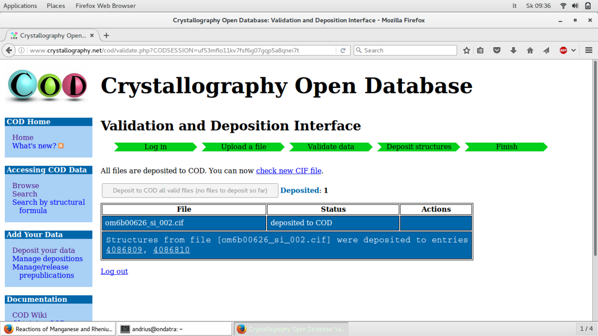
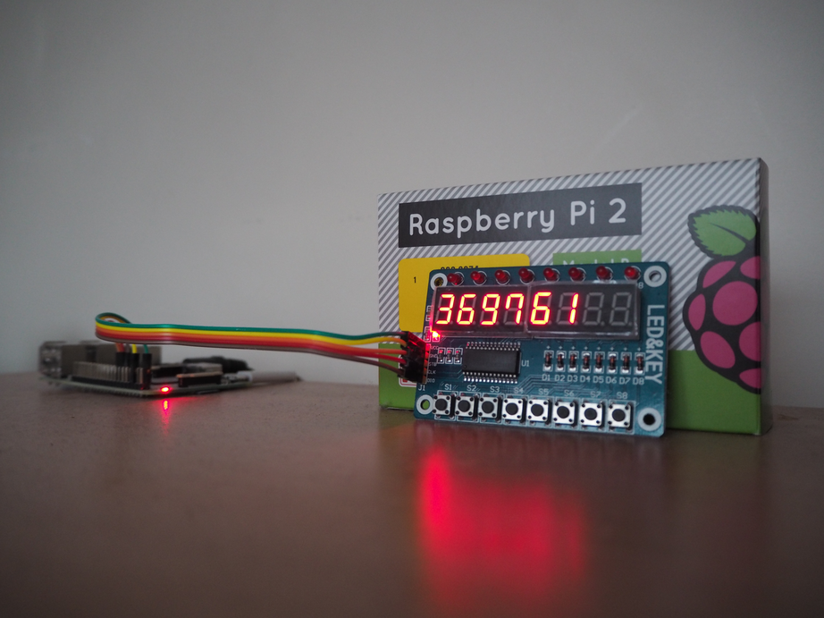

COD entry counter
=================

A nice display of number of entries in the
[Crystallography Open Database](http://www.crystallography.net) :)

How does it look like
---------------------

Before deposition...

Two entries deposited!

*Voilà!*

How does it work
----------------

Provided that **tm1638-io** executables are [built](../../README.md) and
installed in ``$PATH``, the counter is powered using
[this cron.hourly script](cron.hourly/structures-in-cod).
